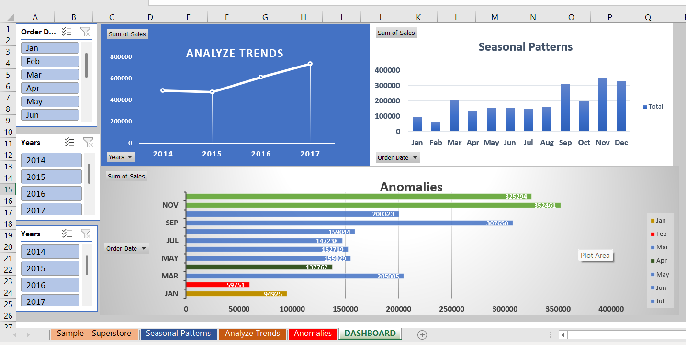

# Sales-Trend-Analysis-indolike-intership-project

# Sales Trend Analysis – Superstore Dataset

## 📌 Project Overview
This project analyzes sales data from the **Superstore Dataset** to identify **trends, seasonal patterns, and anomalies**.  
The analysis was performed using **Microsoft Excel** to create interactive dashboards for better insights.

---

## 📂 Dataset
- **Source:** [Kaggle – Superstore Dataset](https://www.kaggle.com/datasets/vivek468/superstore-dataset-final)
- **Rows:** 9994  
- **Columns:** 21  
- **Key Features:**
  - `Order Date`, `Ship Date`
  - `Sales`, `Quantity`, `Discount`, `Profit`
  - `Category`, `Sub-Category`
  - `Region`, `State`, `City`

---
## 📊 Dashboard Preview

---

## 📈 Analysis Performed
1. **Sales Trends**  
   - Monthly and yearly sales patterns observed.
   - Peak sales periods identified.

2. **Seasonal Patterns**  
   - Sales variation across months and regions.
   - Categories performing well in specific seasons.

3. **Profitability Analysis**  
   - Products with highest and lowest profit margins.
   - Impact of discount on profits.

4. **Regional Performance**  
   - Best-performing regions based on sales and profit.
   - States with consistent growth.

5. **Top & Bottom Products**  
   - High revenue products.
   - Loss-making products identified.

---

## 📝 Key Insights & Conclusion
- **Technology category** showed consistent growth across most regions.  
- **Furniture category** had high sales but lower profitability due to discounts.  
- **West region** performed the best in terms of profit, while some southern states had negative profit trends.  
- High discounts often led to losses, especially in large furniture orders.

---

## 🚀 How to View the Dashboard
1. Download the Excel file from this repository.
2. Open it in Microsoft Excel (Enable Macros if needed).
3. Navigate to the **Dashboard** sheet to explore.

---

## 📬 Contact 
**Email:** harshmishra2907@gmail.com  
**GitHub:** [harshmishra3](https://github.com/harshmishra3)
